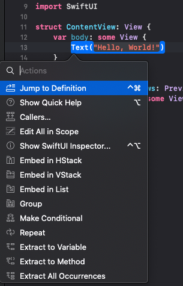
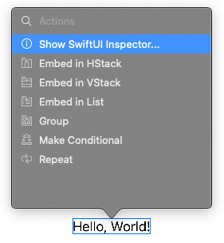
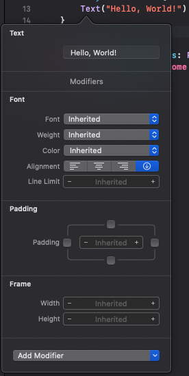
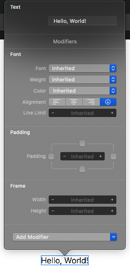
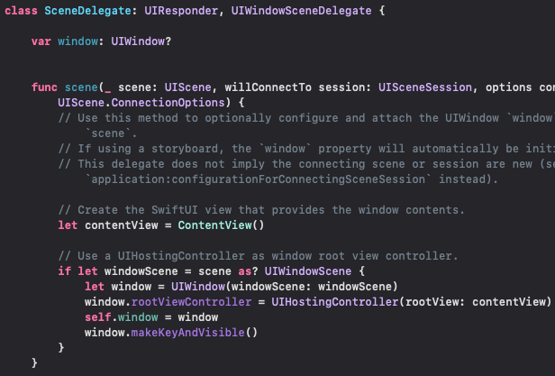

# SwiftUIStudy
SwiftUI를 공부하는 저장소

공부하면서 그때그때 마다 느끼는 것과 기능들을 나열 하는 것으로 순서가 없습니다.

### cmd+click
|code|preview|
|-|-|
|||

* 다양한 기능들이 나오는 팝업
* `Embed in HStack|VStack|List` 를 사용하면 자동으로 code를 넣어주기 때문에 편하다.
* `Extract` 기능이 있어서 코드 편집이 편하다.

### ctrl+option+click
|code|preview|
|-|-|
|||
* 우측에 `Attributes inspector`를 열지 않아도 팝업형태로 열 수 있다.

### ContentView가 어디서 시작되는지, 시작하는 SwiftUI를 바꾸려면 어디를 고쳐야 하는지

* `SceneDelegate.swift`안에 `func scene()`안에 ContentView를 생성에서 추가해주고 있다.
* `UIHostingController`에 들어가는 `rootView` 파라미터를 수정해주면 시작하는 SwiftUI를 변경 할 수 있다.